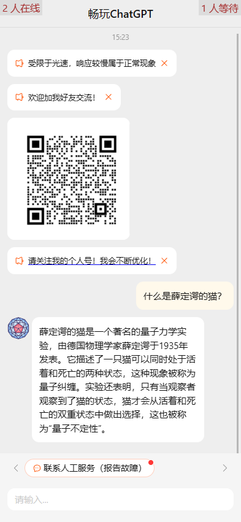

# ChatGPT Web

Multi-user h5 version, 3rd party ChatGPT web page. Uses OpenAPI official web API.

第三方ChatGPT H5客户端，借助Openai官方web的API实现。

**在线体验地址：** <https://h5.chatgpt88.top>


本项目由<https://github.com/yi-ge/chatgpt-web>二开而来，新增加了图片消息，感谢作者

Back-end repository（后端代码仓库github）: <https://github.com/jecklianhuo/web_chatGpt_api.git><br>
Back-end repository（后端代码仓库gitee）: <https://github.com/jecklianhuo/web_chatGpt_api.git><br>

### 希望能获得大家的start

本项目主要是让大家都能畅玩CHATGPT

## Feature

- 部署后可实现在中国大陆访问进行ChatGPT体验
- 支持多账号、多用户
- 支持代码显示
- 支持关联上下文
- 足够简单，易于修改（后端为apikey接入运行即可）

## Preview



## 开发

参照`.env.example`，新建`.env.development`文件，配置好环境变量。

```bash
yarn start
```

## 部署

参照`.env.example`，新建`.env`文件，配置好环境变量。

```bash
yarn build
```

`build`文件夹中即为编译后的静态资源文件。

**⚠⚠⚠请勿用于商业用途，请保留开源仓库地址链接，请自觉遵守约定。**

**⚠⚠⚠现阶段仍有较大BUG，请以Release发布的版本为准！**

## Disclaimers 免责声明

This is not an official OpenAI product. This is a personal project and is not affiliated with OpenAI in any way. Don't sue me.
这不是官方的 OpenAI 产品。这是一个个人项目，与 OpenAI 没有任何关系。别告我。

The code is for demo and testing only.
代码仅用于演示和测试。


## 交流
感兴趣的朋友可以关注我的个人公众号<br>

<br>
也可以添加我的企业微信<br>
<br>